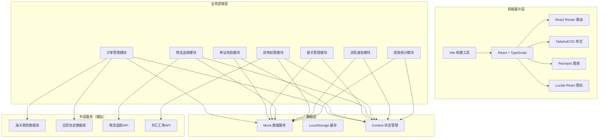
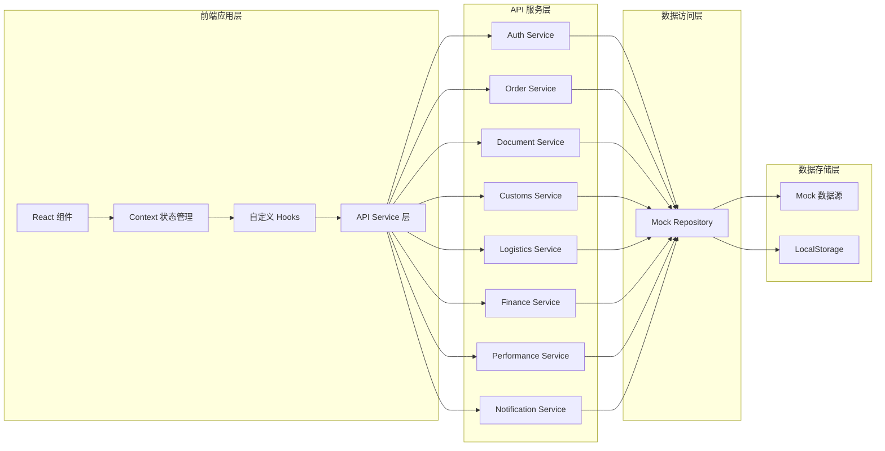
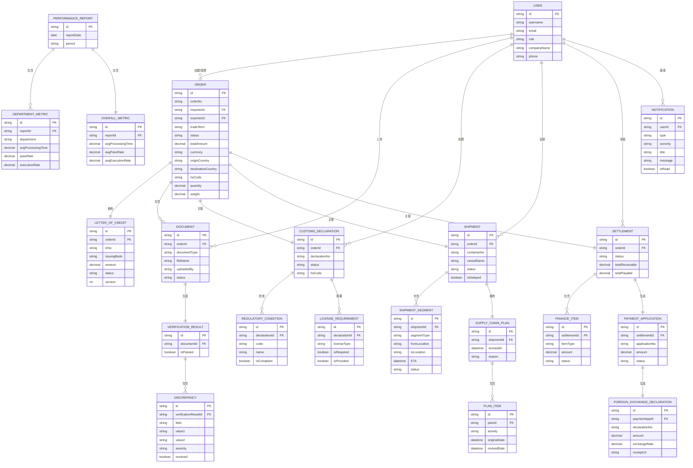

## 1. 架构设计



## 2. 技术描述

- **前端框架**: React@18 + TypeScript@5 - 提供类型安全的组件化开发
- **构建工具**: Vite@5 - 快速的开发服务器和构建工具
- **样式方案**: TailwindCSS@3 + PostCSS - 原子化CSS，快速构建UI
- **状态管理**: React Context + useReducer - 轻量级全局状态管理
- **路由管理**: React Router@6 - 单页应用路由控制
- **图表可视化**: Recharts@2 - React图表库，支持多种图表类型
- **图标库**: Lucide React - 精美线性图标
- **HTTP客户端**: Axios - 异步HTTP请求
- **工具库**: date-fns - 日期处理，lodash-es - 工具函数
- **表单验证**: React Hook Form + Zod - 表单状态管理和schema验证
- **后端**: 前端Mock数据模拟，使用MSW或本地JSON数据
- **数据库**: 前端LocalStorage持久化 + Mock数据
- **UI组件**: 自定义组件库，基于TailwindCSS封装

## 3. 路由定义

| 路由路径 | 页面名称 | 权限角色 | 页面用途 |
|----------|----------|----------|----------|
| `/login` | 登录页 | 公开 | 用户身份认证，角色选择 |
| `/dashboard` | 工作台首页 | 所有角色 | 数据概览、快捷操作、待办事项 |
| `/importer/orders` | 订单列表 | 进口商 | 订单管理、创建、编辑 |
| `/importer/orders/new` | 创建订单 | 进口商 | 新建订单、关税计算 |
| `/importer/orders/:id` | 订单详情 | 进口商 | 查看订单详情、信用证管理 |
| `/importer/tariff` | 关税计算器 | 进口商 | HS编码查询、税率计算 |
| `/exporter/documents` | 单证管理 | 出口商 | 单证上传、列表查看 |
| `/exporter/documents/upload` | 单证上传 | 出口商 | 批量上传提单、箱单、发票 |
| `/exporter/documents/:id/verify` | 单证校验 | 出口商 | 查看校验结果、不符点处理 |
| `/exporter/documents/:id/package` | 电子交单包 | 出口商 | 生成和下载交单包 |
| `/customs/declarations` | 报关单列表 | 报关行 | 报关单管理 |
| `/customs/declarations/new` | 录入报关单 | 报关行 | 报关单录入、监管条件检查 |
| `/customs/declarations/:id` | 报关单详情 | 报关行 | 查看详情、生成申报报文 |
| `/customs/licenses` | 许可证管理 | 报关行 | 许可证预警、补证追踪 |
| `/logistics/shipments` | 运输管理 | 物流商 | 集装箱调度、航段管理 |
| `/logistics/shipments/:id/track` | 物流追踪 | 物流商 | 实时追踪、航段ETA更新 |
| `/logistics/shipments/:id/plan` | 供应链计划 | 物流商 | 供应链计划推算、异常处理 |
| `/finance/settlements` | 费用结算 | 财务 | 应收应付管理、结算清单 |
| `/finance/settlements/:id` | 结算详情 | 财务 | 费用明细、汇率换算 |
| `/finance/payment` | 付汇管理 | 财务 | 付汇申请、外汇申报 |
| `/management/dashboard` | 管理层看板 | 管理层 | KPI仪表盘、绩效报表 |
| `/management/reports` | 绩效报表 | 管理层 | 部门对比、趋势分析 |
| `/notifications` | 消息中心 | 所有角色 | 实时通知、凭证下载 |
| `/profile` | 个人中心 | 所有角色 | 个人信息、设置 |

## 4. API 定义

### 4.1 类型定义

```typescript
// 基础类型
interface BaseEntity {
  id: string;
  createdAt: string;
  updatedAt: string;
}

// 用户类型
type UserRole = 'importer' | 'exporter' | 'customs' | 'logistics' | 'finance' | 'management';

interface User extends BaseEntity {
  username: string;
  email: string;
  role: UserRole;
  companyName: string;
  companyId: string;
  avatar?: string;
  phone: string;
}

// 订单类型
type TradeTerm = 'FOB' | 'CIF' | 'CFR' | 'EXW' | 'FCA' | 'CPT' | 'CIP' | 'DAP' | 'DPU' | 'DDP';
type OrderStatus = 'draft' | 'pending_confirmation' | 'confirmed' | 'documents_uploaded' | 'customs_declared' | 'in_transit' | 'delivered' | 'completed' | 'cancelled';

interface Order extends BaseEntity {
  orderNo: string;
  importerId: string;
  exporterId: string;
  tradeTerm: TradeTerm;
  status: OrderStatus;
  totalAmount: number;
  currency: string;
  originCountry: string;
  destinationCountry: string;
  hsCode: string;
  goodsDescription: string;
  quantity: number;
  unit: string;
  weight: number;
  volume: number;
  tariffRate?: number;
  tariffAmount?: number;
  letterOfCredit?: LetterOfCredit;
  documents: Document[];
  customsDeclaration?: CustomsDeclaration;
  shipment?: Shipment;
  settlement?: Settlement;
}

// 信用证类型
type LCStatus = 'draft' | 'pending_exporter_confirm' | 'exporter_confirmed' | 'exporter_rejected' | 'issued' | 'amended' | 'expired';

interface LetterOfCredit extends BaseEntity {
  orderId: string;
  lcNo: string;
  issuingBank: string;
  advisingBank: string;
  beneficiary: string;
  applicant: string;
  amount: number;
  currency: string;
  expiryDate: string;
  latestShipmentDate: string;
  terms: string;
  status: LCStatus;
  version: number;
}

// 单证类型
type DocumentType = 'bill_of_lading' | 'packing_list' | 'commercial_invoice' | 'certificate_of_origin' | 'insurance_policy' | 'other';
type DocumentStatus = 'uploaded' | 'verifying' | 'verified' | 'discrepancy_found' | 're_uploaded';

interface Document extends BaseEntity {
  orderId: string;
  documentType: DocumentType;
  fileName: string;
  fileUrl: string;
  fileSize: number;
  uploadedBy: string;
  status: DocumentStatus;
  ocrData?: Record<string, any>;
  verificationResult?: VerificationResult;
}

interface VerificationResult {
  isPassed: boolean;
  checkedAt: string;
  discrepancies: Discrepancy[];
}

interface Discrepancy {
  field: string;
  document1: string;
  value1: string;
  document2: string;
  value2: string;
  severity: 'warning' | 'error';
  resolved: boolean;
}

// 报关单类型
type CustomsStatus = 'draft' | 'pending' | 'license_missing' | 'ready_to_submit' | 'submitted' | 'accepted' | 'rejected' | 'cleared';

interface CustomsDeclaration extends BaseEntity {
  orderId: string;
  declarationNo: string;
  customsBrokerId: string;
  status: CustomsStatus;
  hsCode: string;
  goodsDescription: string;
  quantity: number;
  declaredValue: number;
  currency: string;
  originCountry: string;
  destinationCountry: string;
  regulatoryConditions: RegulatoryCondition[];
  requiredLicenses: LicenseRequirement[];
  declarationMessage?: string;
}

interface RegulatoryCondition {
  code: string;
  name: string;
  description: string;
  isCompliant: boolean;
}

interface LicenseRequirement {
  licenseType: string;
  licenseName: string;
  isRequired: boolean;
  isProvided: boolean;
  licenseNo?: string;
  expiryDate?: string;
}

// 物流运输类型
type ShipmentStatus = 'pending' | 'container_loaded' | 'departed' | 'in_transit' | 'arrived' | 'delivered' | 'delayed';

interface Shipment extends BaseEntity {
  orderId: string;
  logisticsProviderId: string;
  containerNo: string;
  vesselName: string;
  voyageNo: string;
  status: ShipmentStatus;
  segments: ShipmentSegment[];
  currentLocation?: Location;
  isDelayed: boolean;
  delayHours?: number;
  delayReason?: string;
  supplyChainPlan?: SupplyChainPlan;
}

interface ShipmentSegment {
  id: string;
  segmentType: 'loading' | 'ocean_freight' | 'transshipment' | 'discharging' | 'inland_transport';
  fromLocation: Location;
  toLocation: Location;
  estimatedDepartureTime: string;
  actualDepartureTime?: string;
  estimatedArrivalTime: string;
  actualArrivalTime?: string;
  status: 'pending' | 'in_progress' | 'completed' | 'delayed';
}

interface Location {
  name: string;
  country: string;
  portCode?: string;
  latitude?: number;
  longitude?: number;
}

interface SupplyChainPlan {
  originalPlan: PlanItem[];
  revisedPlan: PlanItem[];
  revisedAt: string;
  reason: string;
}

interface PlanItem {
  activity: string;
  originalDate: string;
  revisedDate: string;
  responsibleParty: string;
}

// 财务结算类型
type SettlementStatus = 'pending' | 'calculated' | 'invoiced' | 'payment_pending' | 'payment_processing' | 'paid' | 'completed';

interface Settlement extends BaseEntity {
  orderId: string;
  accountantId: string;
  status: SettlementStatus;
  receivables: FinanceItem[];
  payables: FinanceItem[];
  totalReceivable: number;
  totalPayable: number;
  netAmount: number;
  currency: string;
  exchangeRate?: number;
  billOfLadingDate?: string;
  settlementDate?: string;
  paymentApplication?: PaymentApplication;
  foreignExchangeDeclaration?: ForeignExchangeDeclaration;
}

interface FinanceItem {
  id: string;
  itemType: string;
  description: string;
  amount: number;
  currency: string;
  dueDate: string;
  status: 'pending' | 'paid' | 'received';
}

interface PaymentApplication extends BaseEntity {
  settlementId: string;
  applicationNo: string;
  amount: number;
  currency: string;
  payee: string;
  payeeBank: string;
  payeeAccount: string;
  purpose: string;
  status: 'draft' | 'submitted' | 'approved' | 'processed' | 'rejected';
  applicationDate: string;
  processingDate?: string;
}

interface ForeignExchangeDeclaration extends BaseEntity {
  paymentApplicationId: string;
  declarationNo: string;
  declarationDate: string;
  amount: number;
  currency: string;
  exchangeRate: number;
  receiptUrl: string;
  status: 'pending' | 'submitted' | 'completed';
}

// 绩效统计类型
interface PerformanceReport extends BaseEntity {
  reportDate: string;
  period: 'daily' | 'weekly' | 'monthly';
  departmentMetrics: DepartmentMetric[];
  overallMetrics: OverallMetric;
}

interface DepartmentMetric {
  department: string;
  role: UserRole;
  documentProcessingTime: number; // 平均处理时长(小时)
  customsPassRate: number; // 报关通过率
  orderExecutionRate: number; // 订单执行率
  totalOrders: number;
  completedOrders: number;
  delayedOrders: number;
}

interface OverallMetric {
  avgDocumentProcessingTime: number;
  avgCustomsPassRate: number;
  avgOrderExecutionRate: number;
  totalRevenue: number;
  costSaving: number;
  efficiencyImprovement: number;
}

// 消息通知类型
type NotificationType = 'document_discrepancy' | 'license_missing' | 'shipment_delay' | 'order_status' | 'payment_due' | 'system';
type NotificationSeverity = 'info' | 'warning' | 'error' | 'success';

interface Notification extends BaseEntity {
  userId: string;
  type: NotificationType;
  severity: NotificationSeverity;
  title: string;
  message: string;
  relatedEntityId?: string;
  relatedEntityType?: string;
  isRead: boolean;
  attachmentUrl?: string;
  actionUrl?: string;
}
```

### 4.2 API 接口定义

```typescript
// 认证相关
interface AuthAPI {
  login(username: string, password: string, role: UserRole): Promise<{ user: User; token: string }>;
  logout(): Promise<void>;
  getCurrentUser(): Promise<User>;
}

// 订单相关
interface OrderAPI {
  getOrders(params?: { status?: OrderStatus; page?: number; pageSize?: number }): Promise<{ data: Order[]; total: number }>;
  getOrderById(id: string): Promise<Order>;
  createOrder(data: Partial<Order>): Promise<Order>;
  updateOrder(id: string, data: Partial<Order>): Promise<Order>;
  deleteOrder(id: string): Promise<void>;
  calculateTariff(hsCode: string, originCountry: string, destinationCountry: string, amount: number): Promise<{ rate: number; amount: number; preferentialRate?: number; preferentialAmount?: number; tradeAgreement?: string }>;
}

// 信用证相关
interface LetterOfCreditAPI {
  generateDraft(orderId: string): Promise<LetterOfCredit>;
  sendForConfirmation(lcId: string): Promise<LetterOfCredit>;
  confirmLC(lcId: string): Promise<LetterOfCredit>;
  rejectLC(lcId: string, reason: string): Promise<LetterOfCredit>;
  getLCByOrderId(orderId: string): Promise<LetterOfCredit>;
}

// 单证相关
interface DocumentAPI {
  getDocuments(orderId: string): Promise<Document[]>;
  uploadDocument(orderId: string, file: File, type: DocumentType): Promise<Document>;
  getDocument(id: string): Promise<Document>;
  verifyDocuments(orderId: string): Promise<VerificationResult>;
  resolveDiscrepancy(documentId: string, discrepancyId: string, resolution: string): Promise<Document>;
  generateElectronicPackage(orderId: string): Promise<{ packageUrl: string; packageName: string }>;
}

// 报关相关
interface CustomsAPI {
  getDeclarations(params?: { status?: CustomsStatus; page?: number; pageSize?: number }): Promise<{ data: CustomsDeclaration[]; total: number }>;
  getDeclaration(id: string): Promise<CustomsDeclaration>;
  createDeclaration(orderId: string, data: Partial<CustomsDeclaration>): Promise<CustomsDeclaration>;
  updateDeclaration(id: string, data: Partial<CustomsDeclaration>): Promise<CustomsDeclaration>;
  checkRegulatoryConditions(hsCode: string, originCountry: string): Promise<RegulatoryCondition[]>;
  checkLicenseRequirements(hsCode: string): Promise<LicenseRequirement[]>;
  generateDeclarationMessage(id: string): Promise<{ messageContent: string; messageFormat: string }>;
}

// 物流相关
interface LogisticsAPI {
  getShipments(params?: { status?: ShipmentStatus; page?: number; pageSize?: number }): Promise<{ data: Shipment[]; total: number }>;
  getShipment(id: string): Promise<Shipment>;
  createShipment(orderId: string, data: Partial<Shipment>): Promise<Shipment>;
  updateShipment(id: string, data: Partial<Shipment>): Promise<Shipment>;
  updateSegmentStatus(shipmentId: string, segmentId: string, status: string, actualTime?: string): Promise<Shipment>;
  checkShipmentDelay(shipmentId: string): Promise<{ isDelayed: boolean; delayHours: number; reason?: string }>;
  recalculateSupplyChainPlan(shipmentId: string, delayHours: number): Promise<SupplyChainPlan>;
  getVesselLocation(vesselName: string): Promise<Location>;
}

// 财务相关
interface FinanceAPI {
  getSettlements(params?: { status?: SettlementStatus; page?: number; pageSize?: number }): Promise<{ data: Settlement[]; total: number }>;
  getSettlement(id: string): Promise<Settlement>;
  calculateReceivablesPayables(orderId: string): Promise<{ receivables: FinanceItem[]; payables: FinanceItem[]; totalReceivable: number; totalPayable: number }>;
  generateSettlementList(orderId: string): Promise<Settlement>;
  createPaymentApplication(settlementId: string, data: Partial<PaymentApplication>): Promise<PaymentApplication>;
  submitPaymentApplication(appId: string): Promise<PaymentApplication>;
  generateForeignExchangeDeclaration(appId: string): Promise<ForeignExchangeDeclaration>;
  getExchangeRate(fromCurrency: string, toCurrency: string): Promise<{ rate: number; date: string }>;
}

// 绩效统计相关
interface PerformanceAPI {
  getReport(date: string, period: 'daily' | 'weekly' | 'monthly'): Promise<PerformanceReport>;
  getDepartmentMetrics(department: string, startDate: string, endDate: string): Promise<DepartmentMetric[]>;
  getOverallMetrics(startDate: string, endDate: string): Promise<OverallMetric>;
  sendReportToMobile(reportId: string, mobile: string): Promise<boolean>;
}

// 消息通知相关
interface NotificationAPI {
  getNotifications(params?: { type?: NotificationType; isRead?: boolean; page?: number; pageSize?: number }): Promise<{ data: Notification[]; total: number }>;
  markAsRead(notificationId: string): Promise<Notification>;
  markAllAsRead(userId: string): Promise<boolean>;
  getUnreadCount(userId: string): Promise<number>;
  pushNotification(users: string[], notification: Omit<Notification, 'id' | 'createdAt' | 'updatedAt' | 'isRead'>): Promise<boolean>;
}
```

## 5. 服务架构图



## 6. 数据模型

### 6.1 数据模型ER图



### 6.2 模拟数据初始化

```typescript
// Mock 数据初始化脚本
const initMockData = () => {
  // 初始化用户数据
  const users: User[] = [
    {
      id: 'user_001',
      username: 'importer01',
      email: 'importer01@trade.com',
      role: 'importer',
      companyName: '华盛进出口贸易有限公司',
      companyId: 'COMP_IMP_001',
      phone: '13800138001',
      createdAt: '2026-01-01T00:00:00Z',
      updatedAt: '2026-01-01T00:00:00Z',
      avatar: 'https://trae-api-cn.mchost.guru/api/ide/v1/text_to_image?prompt=business%20man%20portrait%20professional&image_size=square'
    },
    {
      id: 'user_002',
      username: 'exporter01',
      email: 'exporter01@trade.com',
      role: 'exporter',
      companyName: '万达制造有限公司',
      companyId: 'COMP_EXP_001',
      phone: '13800138002',
      createdAt: '2026-01-01T00:00:00Z',
      updatedAt: '2026-01-01T00:00:00Z',
      avatar: 'https://trae-api-cn.mchost.guru/api/ide/v1/text_to_image?prompt=asian%20business%20woman%20professional&image_size=square'
    },
    {
      id: 'user_003',
      username: 'customs01',
      email: 'customs01@trade.com',
      role: 'customs',
      companyName: '迅捷报关服务有限公司',
      companyId: 'COMP_CUS_001',
      phone: '13800138003',
      createdAt: '2026-01-01T00:00:00Z',
      updatedAt: '2026-01-01T00:00:00Z',
      avatar: 'https://trae-api-cn.mchost.guru/api/ide/v1/text_to_image?prompt=customs%20officer%20professional%20portrait&image_size=square'
    },
    {
      id: 'user_004',
      username: 'logistics01',
      email: 'logistics01@trade.com',
      role: 'logistics',
      companyName: '环球物流集团',
      companyId: 'COMP_LOG_001',
      phone: '13800138004',
      createdAt: '2026-01-01T00:00:00Z',
      updatedAt: '2026-01-01T00:00:00Z',
      avatar: 'https://trae-api-cn.mchost.guru/api/ide/v1/text_to_image?prompt=logistics%20manager%20professional%20portrait&image_size=square'
    },
    {
      id: 'user_005',
      username: 'finance01',
      email: 'finance01@trade.com',
      role: 'finance',
      companyName: '华盛进出口贸易有限公司',
      companyId: 'COMP_IMP_001',
      phone: '13800138005',
      createdAt: '2026-01-01T00:00:00Z',
      updatedAt: '2026-01-01T00:00:00Z',
      avatar: 'https://trae-api-cn.mchost.guru/api/ide/v1/text_to_image?prompt=accountant%20professional%20portrait%20woman&image_size=square'
    },
    {
      id: 'user_006',
      username: 'manager01',
      email: 'manager01@trade.com',
      role: 'management',
      companyName: '华盛进出口贸易有限公司',
      companyId: 'COMP_IMP_001',
      phone: '13800138006',
      createdAt: '2026-01-01T00:00:00Z',
      updatedAt: '2026-01-01T00:00:00Z',
      avatar: 'https://trae-api-cn.mchost.guru/api/ide/v1/text_to_image?prompt=ceo%20business%20man%20executive%20portrait&image_size=square'
    }
  ];

  // 初始化示例订单数据
  const orders: Order[] = [
    {
      id: 'order_001',
      orderNo: 'ORD-2026-06001',
      importerId: 'user_001',
      exporterId: 'user_002',
      tradeTerm: 'CIF',
      status: 'documents_uploaded',
      totalAmount: 125000,
      currency: 'USD',
      originCountry: '德国',
      destinationCountry: '中国',
      hsCode: '84713000',
      goodsDescription: '便携式数字自动数据处理设备',
      quantity: 500,
      unit: '台',
      weight: 2500,
      volume: 15,
      tariffRate: 0,
      tariffAmount: 0,
      createdAt: '2026-06-10T09:00:00Z',
      updatedAt: '2026-06-15T14:30:00Z'
    },
    {
      id: 'order_002',
      orderNo: 'ORD-2026-06002',
      importerId: 'user_001',
      exporterId: 'user_002',
      tradeTerm: 'FOB',
      status: 'confirmed',
      totalAmount: 89000,
      currency: 'USD',
      originCountry: '日本',
      destinationCountry: '中国',
      hsCode: '85258013',
      goodsDescription: '智能手机',
      quantity: 2000,
      unit: '台',
      weight: 3000,
      volume: 20,
      tariffRate: 0,
      tariffAmount: 0,
      createdAt: '2026-06-12T11:00:00Z',
      updatedAt: '2026-06-14T16:00:00Z'
    },
    {
      id: 'order_003',
      orderNo: 'ORD-2026-06003',
      importerId: 'user_001',
      exporterId: 'user_002',
      tradeTerm: 'CFR',
      status: 'in_transit',
      totalAmount: 256000,
      currency: 'USD',
      originCountry: '韩国',
      destinationCountry: '中国',
      hsCode: '85423100',
      goodsDescription: '集成电路',
      quantity: 50000,
      unit: '个',
      weight: 500,
      volume: 2,
      tariffRate: 0,
      tariffAmount: 0,
      createdAt: '2026-06-01T08:00:00Z',
      updatedAt: '2026-06-15T10:00:00Z'
    }
  ];

  // 存储到 localStorage
  localStorage.setItem('users', JSON.stringify(users));
  localStorage.setItem('orders', JSON.stringify(orders));
};
```
