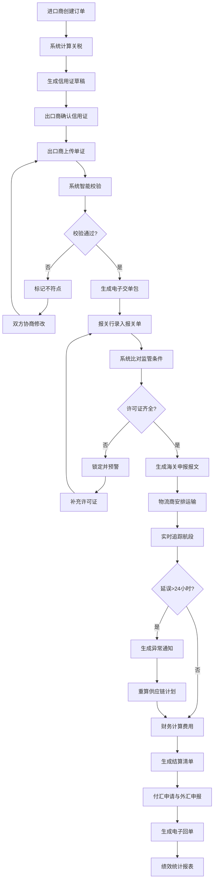

## 1. 产品概述

国际贸易综合服务平台是一款面向进出口贸易全链条的协同管理系统，通过打通进口商、出口商、报关行、物流商和财务五大角色的业务流程，实现订单与单证的全程可视化、智能化协同。

- 解决国际贸易中单证流转效率低、人工校验误差大、信息不对称等痛点，实现贸易全流程数字化管理
- 目标用户涵盖进口企业、出口企业、报关代理公司、物流公司和财务部门，通过智能算法自动匹配关税、校验单证、追踪物流，提升整体贸易效率

## 2. 核心 Features

### 2.1 用户角色

| 角色 | 注册方式 | 核心权限 |
|------|----------|----------|
| 进口商 | 企业资质审核注册 | 在线下单、选择贸易术语、查看关税计算、确认信用证、查看订单状态、接收异常通知 |
| 出口商 | 企业资质审核注册 | 确认信用证、上传提单/箱单/发票、查看单证校验结果、下载电子交单包、接收不符点通知 |
| 报关行 | 企业资质审核注册 | 录入报关单、比对备案信息、查看监管条件、生成海关申报报文、处理许可证预警 |
| 物流商 | 企业资质审核注册 | 安排集装箱运输、录入航段信息、更新船舶状态、查看延误通知、重新推算供应链计划 |
| 财务人员 | 企业内部账号分配 | 计算应收应付、生成费用结算清单、申请付汇、生成外汇申报回单、查看财务报表 |

### 2.2 Feature 模块

1. **登录/角色选择页**：身份验证、角色切换、权限控制
2. **进口商工作台**：订单管理、关税计算、信用证管理、异常预警中心
3. **出口商工作台**：单证上传、单证校验、电子交单包、不符点协商
4. **报关行工作台**：报关单录入、监管条件检查、许可证预警、海关报文生成
5. **物流商工作台**：集装箱调度、航段追踪、船期监控、异常处理
6. **财务工作台**：费用结算、应收应付管理、付汇申请、外汇申报
7. **管理层看板**：绩效统计报表、部门对比分析、KPI监控仪表盘
8. **消息通知中心**：实时消息推送、凭证下载、待办事项提醒

### 2.3 页面详情

| 页面名称 | 模块名称 | Feature 描述 |
|----------|----------|--------------|
| 登录页 | 身份认证 | 账号密码登录、企业资质展示、角色选择、双因素认证 |
| 进口商工作台 | 订单列表 | 订单创建、编辑、删除、状态筛选、贸易术语选择 |
| 进口商工作台 | 关税计算器 | HS编码输入、原产地/目的地选择、自动匹配最优税率、自贸协定优惠展示 |
| 进口商工作台 | 信用证管理 | 信用证草稿生成、推送确认、历史版本追溯、状态追踪 |
| 出口商工作台 | 单证上传 | 提单/箱单/发票批量上传、OCR识别、分类管理 |
| 出口商工作台 | 智能校验 | 重量/件数/唛头自动比对、不符点标记、差异高亮显示 |
| 出口商工作台 | 电子交单包 | 一键打包生成、下载、发送、状态追踪 |
| 报关行工作台 | 报关单录入 | 商品信息录入、自动带入备案数据、监管条件实时检查 |
| 报关行工作台 | 许可证管理 | 缺失许可证锁定、预警推送、补证流程追踪 |
| 物流商工作台 | 航段追踪 | 集装箱状态、各航段ETA实时更新、地图可视化展示 |
| 物流商工作台 | 船期监控 | 靠港延误检测、异常通知生成、供应链计划重算 |
| 财务工作台 | 费用结算 | 信用证条款解析、应收应付自动计算、费用明细展示 |
| 财务工作台 | 付汇管理 | 在线付汇申请、外汇申报回单生成、凭证下载 |
| 管理层看板 | 绩效报表 | 单证流转时效统计、报关通过率、订单执行率、部门对比分析 |
| 消息中心 | 实时通知 | 单证不符、许可证缺失、船期延误等关键事件推送、凭证下载链接 |

## 3. 核心流程

### 3.1 订单创建与关税计算流程
进口商登录系统创建订单，录入商品信息（HS编码、原产地、目的地）和选择贸易术语（FOB/CIF/CFR等），系统根据HS编码自动匹配海关税则，结合原产地规则和自贸协定数据库计算最优关税税率，展示普通税率、最惠国税率和协定税率对比，进口商确认后系统自动生成信用证申请草稿并推送至出口商确认。

### 3.2 单证上传与智能校验流程
出口商确认信用证后，上传提单、箱单、发票等全套单证，系统通过OCR识别单证关键字段（重量、件数、唛头、货描、金额等），自动进行单证间交叉校验，发现不一致字段自动标记并高亮显示，推送通知给进出口双方协商修改，全部通过后系统自动生成标准格式的电子交单包供下载和发送。

### 3.3 报关申报流程
报关行获取订单信息后录入报关单，系统自动比对进口商备案信息、商品监管条件和许可证要求，缺失必要许可证时自动锁定申报流程并推送预警通知，补充完整后系统生成符合海关标准的电子申报报文，支持直接对接单一窗口。

### 3.4 物流追踪与异常处理流程
物流商安排集装箱运输并录入各航段信息（装船港、中转港、卸货港、预计抵达时间），系统实时追踪船舶动态，当船舶靠港延误超过24小时时自动生成异常通知，推送至所有相关方，并根据延误时间自动重新推算后续供应链计划（清关、仓储、配送等环节时间调整）。

### 3.5 财务结算与外汇申报流程
财务人员根据信用证支付条款自动计算应收应付金额，船开后系统根据提单日期自动触发费用结算清单生成，支持在线申请付汇并对接银行系统，付汇成功后自动生成外汇申报电子回单，所有财务凭证支持PDF下载和归档。

### 3.6 绩效统计与推送流程
系统每日凌晨自动统计各业务部门的KPI数据，包括单证流转时效（平均处理时长）、报关通过率（一次性通过/总申报数）、订单执行率（按时完成/总订单数），生成绩效对比报表和趋势分析图表，通过移动端消息推送给管理层查看。

## 4. 用户界面设计

### 4.1 设计风格

**设计理念**：采用「专业金融级商务风格」，以深蓝为主色调，搭配金色和银灰色作为辅助色，营造国际贸易的专业感和可信赖感。

- **主色调**：深海蓝 `#0A2463` - 代表专业、信任、稳重
- **辅助色**：商务金 `#D4AF37` - 代表金融、价值、高端
- **功能色**：
  - 成功绿 `#2ECC71` - 单证通过、状态正常
  - 预警橙 `#F39C12` - 待处理、提醒
  - 危险红 `#E74C3C` - 异常、延误、不符点
  - 信息蓝 `#3498DB` - 普通通知、流程中
- **中性色**：
  - 背景灰 `#F8F9FA`
  - 边框灰 `#DEE2E6`
  - 文本主色 `#212529`
  - 文本次色 `#6C757D`

**字体选择**：
- 标题字体：`Noto Serif SC` - 衬线字体，彰显专业与权威感
- 正文字体：`Noto Sans SC` - 无衬线字体，确保长时间阅读舒适度
- 数字字体：`JetBrains Mono` - 等宽字体，金额和数据展示更清晰

**布局风格**：
- 左侧导航栏 + 顶部状态栏 + 主工作区的经典企业级应用布局
- 卡片式模块展示，清晰的信息层级
- 数据表格为主，配合可视化图表
- 充足的留白，避免信息过载

**图标风格**：
- 线性图标，2px描边，圆润风格
- 保持一致性，同一功能使用相同图标
- 关键操作使用图标+文字组合

**按钮风格**：
- 主按钮：深蓝色填充，圆角8px，悬停有微交互
- 次级按钮：描边样式，悬停填充
- 危险按钮：红色系，用于删除、拒绝等操作

### 4.2 页面设计总览

| 页面名称 | 模块名称 | UI 元素 |
|----------|----------|----------|
| 登录页 | 品牌展示区 | 左侧深蓝色渐变背景 + 品牌Logo + 平台标语，右侧登录表单 |
| 登录页 | 表单区 | 企业名称、账号、密码输入框，角色选择下拉，双因素认证，登录按钮 |
| 工作台总览 | 顶部状态栏 | 企业Logo、用户信息、消息通知铃铛、角色切换、退出登录 |
| 工作台总览 | 左侧导航 | 折叠式菜单，图标+文字，当前选中高亮，角标提示未读数量 |
| 工作台总览 | 数据概览卡 | 四色统计卡片展示关键指标（订单数、单证数、异常数、金额） |
| 订单列表页 | 筛选区 | 多条件筛选（日期、状态、贸易术语），搜索框，高级筛选按钮 |
| 订单列表页 | 数据表格 | 订单号、客户、金额、状态、操作列，支持排序、分页、批量操作 |
| 订单详情页 | 信息分区 | 基本信息、商品明细、关税计算、信用证、单证进度时间轴 |
| 单证上传页 | 上传区域 | 拖拽上传区，文件列表，预览功能，进度条 |
| 单证校验页 | 对比视图 | 三栏布局展示提单/箱单/发票关键字段，不符点红色高亮标记 |
| 物流追踪页 | 地图视图 | 世界地图展示航线，集装箱图标标记当前位置，时间轴展示各节点 |
| 财务结算页 | 费用明细 | 费用分类树状展示，金额合计，汇率换算，审批状态 |
| 管理层看板 | 仪表盘 | 多种图表类型（柱状图对比、折线图趋势、饼图占比、数据卡片） |
| 消息中心 | 通知列表 | 分类标签（全部/异常/待办/通知），消息卡片，已读/未读状态 |

### 4.3 响应式设计

- **设计原则**：桌面端优先，适配1080p及以上分辨率，同时支持平板和移动端查看
- **断点设置**：
  - 桌面端：≥1440px - 完整功能 + 多栏布局
  - 平板端：768px - 1439px - 导航可折叠，表格横向滚动
  - 移动端：<768px - 底部导航，卡片式列表，核心功能精简
- **触摸优化**：移动端按钮最小尺寸48x48px，关键操作易于点击
- **表格适配**：小屏幕下表格转为卡片式展示，每条记录独立卡片

### 4.4 动效与交互

- **页面加载**：骨架屏占位，数据加载完成后平滑过渡
- **导航切换**：左侧菜单展开/收起有平滑过渡动画
- **表格交互**：行悬停高亮，选中行有背景色变化
- **通知推送**：右上角消息气泡弹出，带滑入动画和轻微振动反馈
- **状态变化**：订单状态变更时带有高亮闪烁效果，吸引用户注意
- **图表动画**：数据图表加载时带有渐入和数值增长动画
- **弹窗交互**：模态框从底部滑入，背景模糊效果
